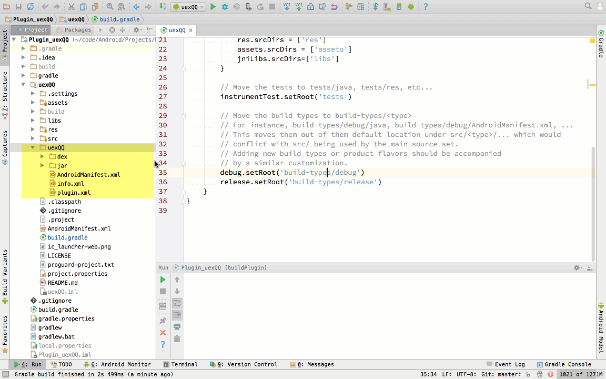

# AppcanPluginDemo-Gradle
AppCan Android 插件demo

####Gradle打包的优势

* **插件工程简洁:** 插件工程引擎部分内容全部在引擎的`aar`文件里面,插件工程只包含插件部分的内容
* **插件包生成简单:** Gradle打包支持`aar`文件,可以把插件包除`info.xml`的部分全部打包在`aar`文件里面
* **调试插件简单:** 前端使用多个插件时,调试只需要把插件包的`aar`文件放入`libs`目录即可
* **支持R.XX.XX方式调用资源:** 用`aar`生成插件包时,可以直接使用`R.id.xxx`

####目前已知的问题

* 由于要启动的`Activity`在引擎的`aar`里面,IDE目前不能识别,直接run插件工程会不能启动应用,需要手动点击应用或者在IDE指定启动的`Activity`  
* `aar`只能在Gradle编译环境下使用.建议不支持的企业版打包服务升级.  
* 由于打包服务器暂时不能连外网,远程依赖不能用,只能把依赖包(`aar`,`jar`)下载到本地.╮(╯▽╰)╭   
* `plugin.xml`打包时不能自动merge，需要手动复制到插件包目录下。   

###aar插件制作步骤(插件中有用到R.xx.xx)

1、 参考Demo工程编写调试好插件  
2、 将`build.gradle`中的`apply plugin: 'com.android.application'`修改成`apply plugin: 'com.android.library'`  
3、 make插件工程，拷贝`build->outputs->aar->***.aar`至插件包`jar`目录下，重命名为插件名称。  
4、 用压缩工具打开aar，删除`assets/widget`目录,删除`AndroidManifest.xml`的`minSdkVersion`，删除`plugin.xml`文件  
5、 复制`plugin.xml`文件到插件包目录,填写`info.xml`,制作插件包。  
6、 将`build.gradle`中的`apply plugin: 'com.android.library'`修改成`apply plugin: 'com.android.application'`  

如果是封装第三方SDK，需要通过config.xml配置appkey，插件包下面放一份`AndroidManifest.xml`，里面只包含需要替换的部分，**同时删掉aar里面对应的内容**，可以参考[融云插件](https://github.com/android-plugin/uexRongCloud)


### 通用导出插件包方法（基于Gradle,插件中没有使用R.xx.xx）

1. 在`build.gradle`最后一行加上：

   ```groovy
   apply from: "https://raw.githubusercontent.com/android-plugin/gradle-plugin/master/buildPlugin.gradle"
   ```

   ​

2. 把插件相关的资源都放到插件文件夹之后执行：

   ```shell
   gradle buildPlugin
   ```

   以上命令执行的操作为：

   - 生成插件工程src部分的jar
   - 生成dex之后的jar
   - 生成插件包(在插件工程根目录下)

   或者找到 `Gradle(IDE右上角)—>XXX—>Tasks—>other—>buildPlugin  `双击即可

**以uexQQ为例：**（gif 1.7M）

 